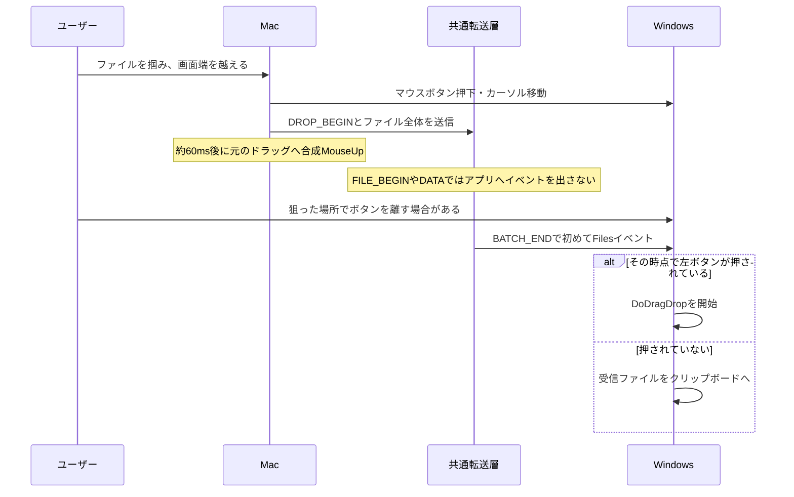
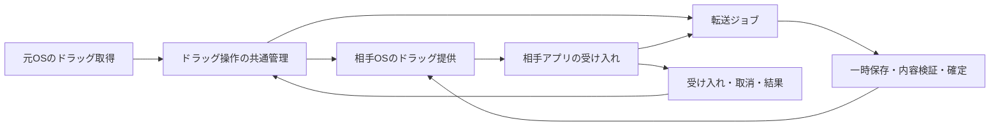

# ドラッグ＆ドロップ構造の調査

調査日：2026-09-27。対象：現在の作業ツリーのMac・Windows実装と、製品要件D02/D04。

## 最新の実装状況：Windows → Mac

同日の追加実装で、WindowsのExplorerからMacのFinder・ファイルを受け取れるアプリへ渡す経路を追加した。
現在の共有マウスで通常ファイルを掴み、接続辺に出る青い帯へ運ぶ。
Macへの受信完了後にWindowsのOLE操作をコピーとして完了し、Macの標準ドラッグへ引き継ぐ。
操作IDを本線・ファイル転送の両方に付け、取消後の遅れた受信や別の操作への混入を防ぐ。
原本と一般クリップボードを保持する。両側の通信バージョン12で有効になる。

- Mac・共通の通常テスト59件と、Windows実機の7件が成功。個別実行用の2件は除外。
- Windows実機でOLE形式の読み取りと受け取りウィンドウの登録を検証した。
- Macの実際のAppKitで、ドラッグ元、非表示パネル、開始イベント、ファイルURL・アイコンの生成を検証した。
- 両アプリへ反映し、本線と転送用接続の復帰を確認した。
- **ExplorerからFinderへ掴んで離す一連の操作は利用者の確認待ち。** API単体の試験は操作全体の成功を保証しない。

通常ファイルの複数選択に対応する（最大64件、合計10GiB）。大容量は境界で転送完了を待つ。
フォルダ・仮想ファイル・WindowsにつないだマウスをMacへ共有する機能は未対応。
計画と制約は [WindowsからMacへのファイルドラッグ](plans/2026-09-27-windows-to-mac-drag.md)、
検証記録は [reverse-drag-verification.json](../output/2026-09-27-drag-drop-investigation/reverse-drag-verification.json) を参照。

以下は初回調査と、その後のMac → Windows修正の記録。初回調査本文にある「Windows → Macの経路がない」という状態は、上記実装によって変わっている。

## Mac → Windowsの修正履歴

追記（同日）：利用者の症状は「Mac→Windowsでファイルを掴むとカーソルも境界を越えない」と確認した。
以下の項目4にある検出の基準値を、MouseDown時点で記録する実装へ修正。
押下ごとの世代管理も追加し、キャンセル済みのファイルや遅れて届いた読み出し結果を除外する。
検出処理は [file_drag.rs](~/ZCodeProject/tsunagu/crates/mac/src/file_drag.rs) に分離し、5件の回帰テストを追加した。
本文とコード根拠一覧は調査時点の記録。この最初の修正では検出部分を扱い、その後の対応を続報と冒頭に記載した。

### 境界で止まる症状への修正と検証

- ファイル一覧の監視は16ms間隔に変更。押下時の基準値と比較するため、最初の監視より前に始まったドラッグも検出できる。
- Mac側のドラッグを終える合成MouseUpは、利用者が物理的にボタンを離した状態として扱わない。
- `cargo test --locked` は50件成功。既存の個別実行用テスト2件（Keychain・10GiB転送）は通常実行では除外。
- 修正を含むMac版を起動し、入力監視・Windowsとの接続・ファイル転送用接続の復帰を確認した。記録は [boundary-fix-runtime.json](~/ZCodeProject/tsunagu/output/2026-09-27-drag-drop-investigation/boundary-fix-runtime.json)。
- 実際のFinderからWindowsへの掴み操作は利用者の確認待ち。現在の境界へ2回当てて切り替える設定を維持している。

### 続報：カーソルだけ越える症状への修正

利用者から「カーソルだけ越える」と回答があった。Windowsログには `DoDragDrop 開始` の記録があり、ファイル受信後のOSへの受け渡しを追加調査した。

| 箇所 | 修正前 | 修正後 |
| --- | --- | --- |
| Macの元ドラッグを終えるイベント | `3`（右ボタン押下） | `EVT_LEFT_UP`（左ボタン解放、値2） |
| Macの自己投稿識別フィールド | `41`（UnixプロセスID。識別値が32bitに切れる） | `42`（64bitのユーザーデータ） |
| Windowsの提供形式 | `dwAspect=4`（アイコン） | SDKの `DVASPECT_CONTENT`（ファイル本体） |
| Windowsのドラッグ元インターフェース | `00000221-…` | 標準の `IID_IDropSource`（`00000121-…`） |

Macでは生成したCGEventをOS APIで読み戻し、修正前の誤ったイベント種別と識別値の欠落を確認した。
Windows実機では、修正前の形式列挙と `QueryInterface` が回帰テストで失敗した。
修正後はMac・共通の通常テスト51件、Windows実機の4件が成功した。
WindowsのShellが実装するフォルダの `IDropTarget` に製品の `IDataObject` を渡し、日本語名のファイルがコピーされ、内容と原本が保たれることも確認した。
このShell試験は専用一時フォルダ内で完結し、カーソルやクリップボードを操作しない。
修正済みの両アプリを配備し、本線とファイル転送経路の再接続を確認した。Windows配備先の実行ファイルはローカルのビルド産物とSHA-256が一致する。
検証記録：[handoff-fix-verification.json](~/ZCodeProject/tsunagu/output/2026-09-27-drag-drop-investigation/handoff-fix-verification.json)。

**未確認の範囲：** Finderで掴んで境界を越え、Windowsの画面上で離す一連の操作は、この修正後に改めて実機確認が必要。Shellへの受け渡し試験はマウス操作を含むE2E試験ではない。

定数はAppleのインストール済みSDK（`CGEventTypes.h` / `IOLLEvent.h`）、[MicrosoftのDVASPECT定義](https://learn.microsoft.com/en-us/windows/win32/api/wtypes/ne-wtypes-dvaspect)、[MicrosoftのIDropSource定義](https://source.dot.net/System.Private.Windows.Core/_generated/136/Windows.Win32.IDropSource.g.cs.html)と照合した。WindowsのテストはSDKのUUIDライブラリにリンクして標準IIDを要求する。

## 初回調査の結論

現在は、画面を越えた時点でファイル全体の転送を始め、受信が終わってからWindows側のドラッグを開始する。大容量でも掴んで別PCの狙った場所へ離せる体験を成立させるには、**ドラッグ操作の管理と、実データの転送を分ける必要がある。**

前回の10GiB対応は転送容量と連続転送を改善したもので、この操作順序は変えていない。

## 初回調査時の確認範囲

- Mac・Windows・共通通信コードを追跡し、Microsoft・Apple・Waylandの公式資料と照合した。
- 共通転送層を小さな診断プログラムで実行した。ドラッグ開始時にアプリへイベントが出ないこと、フォルダだけの送信が `Ok(0)` になることを確認した。
- ドラッグ検出の取りこぼしは、現在の分岐を時系列モデルに当てはめて確認した。OSの実測ではない。
- 既存Macログには、調査対象の掴み検出・掴み切替の記録がなかった。ログだけではユーザーが遭遇した症状を特定できない。
- 実機のマウス・クリップボード・稼働中アプリは操作していない。ネイティブのドラッグ再現試験は未実施。
- 初回調査では調査資料と診断用コードを追加し、製品のドラッグ処理は変更していなかった。その後の修正は冒頭に記載。他作業による変更も進んでいるため、参照時点のソースハッシュを記録した。

## 1. 初回調査時の流れ

入力は本線、ファイルは別の接続を通る。両方の出来事を結びつける操作IDはない。

## 2. 根拠のある問題

優先度は製品体験への影響を示す。静的に分かる処理と、実機で確認すべき結果を区別した。

### 1 — 転送が終わるまで、本来のドラッグが始まらない【最優先】

[Windowsの受信処理](~/ZCodeProject/tsunagu/crates/win/src/main.rs:597) は `Files` を受信してから `drop && BTN_W[0]` を確認し、押下中の場合だけ `dragdrop::start` を呼ぶ。[共通の受信処理](~/ZCodeProject/tsunagu/crates/common/src/lib.rs:913) がこのイベントを返すのは `BATCH_END` の時点だけ。

**結果：** ボタンを離すタイミングより転送完了が遅いと、狙った場所へのドロップにならず、クリップボードへの受け渡しになる。正しい操作が回線速度とファイル容量に左右される。共通層のイベント発火時点は実行確認済み。実際のOS画面上の再現は未実施。

### 2 — Windows→Macのファイルドラッグが成立する経路がない【最優先】

[Windowsからの復帰判定](~/ZCodeProject/tsunagu/crates/win/src/main.rs:1832) はいずれかのマウスボタンが押されていると画面端からの復帰通知を出さない。Mac側の絶対座標による復帰も通常の移動イベントに限定される。[Macの受信処理](~/ZCodeProject/tsunagu/crates/mac/src/main.rs:681) はファイルを常に一般クリップボードへ置き、ドラッグの印を扱わない。

Windows側には元アプリのドラッグオブジェクトを受け取る `IDropTarget` がなく、Mac側にも受信ファイルから `NSDraggingSession` を開始する実装がない。接続のserver/clientを逆にしても、この不足は解消しない。

### 3 — 取り消し・操作の同一性・結果を共有できない【最優先】

[本線プロトコル](~/ZCodeProject/tsunagu/crates/common/src/lib.rs:120) と [共通の完了イベント](~/ZCodeProject/tsunagu/crates/common/src/lib.rs:857) に、ドラッグ操作ID、受け入れ準備完了、ドロップ要求、取消、相手OSでの結果を表す仕組みがない。受信側が参照するのはその瞬間の共通ボタン状態。

**コードから予測される失敗：** 最初のドラッグを離した後、別の操作で再び左ボタンを押したタイミングに転送が終わると、古いファイルでドラッグが始まり得る。これは実機再現待ちの競合条件であり、発生済みとは断定しない。

[Windowsの取消判定](~/ZCodeProject/tsunagu/crates/win/src/dragdrop.rs:466) はEscを取消として返すが、[WindowsのOLE開始と終了](~/ZCodeProject/tsunagu/crates/win/src/dragdrop.rs:498) はコピー以外の結果を一律にクリップボードへ回す。利用者が取り消した場合も「ドロップ先が受けられなかった」と通知し、クリップボードを書き換える分岐になる。

[Macの送信処理](~/ZCodeProject/tsunagu/crates/mac/src/main.rs:583) の成功通知は送信関数の終了で出る。相手アプリへのドロップ完了の確認は受けていない。

### 4 — ドラッグ開始を120ms間隔の監視で推測している【高】

[Macの掴み検出](~/ZCodeProject/tsunagu/crates/mac/src/main.rs:2545) は最初の押下中ポーリングで `changeCount` を基準値として記録し、その後の変更がないとファイルを掴んだと判断しない。

例：ボタン押下0ms → ドラッグ用ペーストボード更新20ms → 初回監視120ms。その初回監視が更新済みの値を基準にするため、以後更新がなければ検出されない。更新が150msなら次の240ms監視で検出される。時系列モデルでこの違いを確認した。

単に監視間隔を短くしても、イベント取得と基準値を記録する順序の問題は残る。

### 5 — 元のドラッグを終える条件が相手の準備と結びついていない【高】

[Macの境界切替](~/ZCodeProject/tsunagu/crates/mac/src/main.rs:1840) は送信関数を呼んだ後、約60ms待って合成MouseUpをMacへ投稿する。[Macの送信処理](~/ZCodeProject/tsunagu/crates/mac/src/main.rs:583) が送信中として要求を拒否しても、呼び出し元には結果が返らず、この終了処理へ進む。

さらに、Windowsへのボタン押下注入がカーソルのワープとOLE開始より先に送られる。[MacからWindowsへの位置決定](~/ZCodeProject/tsunagu/crates/mac/src/main.rs:1874) は以前のWindowsカーソル位置を優先するため、ドラッグ中も境界に対応した位置から入るとは限らない。

**実機確認が必要：** 元画面での意図しないドロップ、移動先での通常クリックや選択操作への混入、カーソルの飛び。現時点ではコードから特定した危険な順序であり、実害の発生を確認したわけではない。

### 6 — ファイル形式とフォルダの表現が足りない【高】

[Macのファイル一覧取得](~/ZCodeProject/tsunagu/crates/mac/src/main.rs:445) はファイルURLを最大64件まで取り出す。[共通送信処理](~/ZCodeProject/tsunagu/crates/common/src/lib.rs:794) は通常ファイルだけを扱い、フォルダを読み飛ばす。子ファイルを1件含むフォルダで `Ok(0)`・受信イベント0件を実行確認した。

[Windowsの提供形式](~/ZCodeProject/tsunagu/crates/win/src/dragdrop.rs:184) は受信済みのローカルファイルパスを渡す `CF_HDROP` だけを提供する。未受信ファイル、アプリ内で生成するファイル、元アプリのFile Promise、画像・URLなどを同じドラッグ処理で扱う仕組みはない。

### 7 — 保存先と完了の意味が操作に合っていない【高】

受信先はいったん `Downloads/Tsunagu`。その後にコピーとしてドロップするため、受信先と最終保存先に二重保管され得る。[WindowsのOLE開始と終了](~/ZCodeProject/tsunagu/crates/win/src/dragdrop.rs:498) も元の受信ファイルを残すと明記している。

「送信完了」「相手側でファイルの検証完了」「OSがドロップを受理」「Photoshopが読み込み完了」「Webへのアップロード完了」は別の事実。現在の送信通知では区別できない。任意の相手アプリの内部処理完了まで、OSのドロップ結果だけから保証することはできない。

## 3. 理想の操作を仕様にする

1. ファイルを掴むと、対象の名前・件数・種類を保持する。原本はそのまま残す。
2. 別PCへ越えると、境界に対応した位置へプレビューが連続して移る。転送完了をドラッグ開始の条件にしない。
3. 相手のアプリが受け取れる形式と操作を確認する。受け取れない場所には、その場で不可を示す。
4. 対応する相手では、狙った場所で離すと行き先が確定する。ユーザーは押し続けず、別の作業へ進める。
5. 必要なデータをバックグラウンドで受け取り、保存・検証・受け渡しの進捗を示す。読み込み先アプリの動作は、そのアプリの通常のドロップ規則に従う。
6. Escや画面を戻る操作を、同じドラッグの取消・行き先変更として扱う。勝手にクリップボードを書き換えない。
7. 未公開の受信データは取消・失敗時に片付ける。すでに相手アプリが取り込んだ後の取消は、そのアプリの取消機能との連携が必要であり、同じ保証にはしない。
8. コピーを既定とする。移動は明示された操作として扱い、元データの削除を単なる送信終了に結びつけない。

## 4. 推奨する構造

### ドラッグ操作と転送ジョブを別々に持つ

- ドラッグ：操作ID、送信元端末、現在の行き先、入力の所有者、移動の世代、項目一覧、許可するコピー/移動、受け入れ状態を保持する。
- 転送：転送ID、元データの参照、サイズ、読み出し位置、内容照合、受信先、取消、再開、空き容量、一時データの寿命を保持する。
- 操作情報は軽量に送る。大量の項目一覧やファイル本体でマウス入力の経路を詰まらせない。
- ドラッグ終了後も、利用者が確定した転送ジョブは継続できる。古い転送の完了通知で新しいドラッグを開始しない。
- 接続時にOS名だけでなく、ドラッグの取得・提供・遅延受け取り・ファイル形式の対応能力を交換する。3台以上や同じOS同士にも同じ管理を使う。

### ネイティブ機能の使い方と限界

| 対象 | 採用候補 | 成立条件と未検証点 |
|---|---|---|
| Windowsへ渡す | `CFSTR_FILEDESCRIPTORW` + `CFSTR_FILECONTENTS`、`IStream`、`IDataObjectAsyncCapability` | メタ情報と実体を分けて渡せる。非同期受け取りは相手側も対応する必要がある。`GetData`をドラッグ中に呼ぶ相手、ストリームのSeek、途中失敗、COMの寿命を検証する。 |
| Macへ渡す | `NSDraggingSession` + `NSFilePromiseProvider` | 受け取り側がFile Promiseを扱う必要がある。ファイルを書き出す処理をメインスレッドから外し、完了・失敗を返す。 |
| 元アプリのドラッグ取得 | Windowsの`IDropTarget`、Macの`NSDraggingDestination`を使う境界の受け口を検討 | 取得できる範囲は登録したウィンドウ等に依存する。他アプリの進行中セッションをそのまま別PCへ移せるAPIではない。元セッションの安全な引き渡しが最大の実機検証点。 |
| Linux/Wayland | データオファーとOS・compositorごとの接続処理 | `start_drag`には元surfaceの入力grabとserialが必要。PC向けの汎用設計に含めるが、Macの入力注入方式の横展開で成立とは判断しない。 |
| 実ファイルのパスだけを受け取るアプリ | 完成済みキャッシュ、OSのファイルプロバイダー、アプリ連携を候補比較 | 仮想ファイル形式だけで全アプリを対応済みにはできない。未受信ファイルのパスを作るだけでは空ファイル・不完全ファイルの読み込みを招く。 |

Windowsの形式と非同期処理は[Shell Clipboard Formats](https://learn.microsoft.com/en-us/windows/win32/shell/clipboard)、[IDataObjectAsyncCapability](https://learn.microsoft.com/en-us/windows/win32/api/shldisp/nn-shldisp-idataobjectasynccapability)、[Shellの転送シナリオ](https://learn.microsoft.com/en-us/windows/win32/shell/datascenarios)に基づく。
Macの方式は[File Promises](https://developer.apple.com/documentation/appkit/supporting-drag-and-drop-through-file-promises)、[Promise受信時のキューと失敗](https://developer.apple.com/documentation/appkit/nsfilepromisereceiver/receivepromisedfiles(atdestination:options:operationqueue:reader:))、[Drag Destination](https://developer.apple.com/library/archive/documentation/Cocoa/Conceptual/DragandDrop/Concepts/dragdestination.html)に基づく。
Waylandの条件は[公式プロトコル仕様](https://wayland.freedesktop.org/docs/html/apa.html#protocol-spec-wl_data_device)に基づく。

この構成は公式APIを組み合わせた設計提案であり、Tsunaguで実装・実機検証済みではない。特に、ファイルを後から提供する機能と、元アプリのドラッグを安全に引き継ぐ機能は別々に検証する必要がある。

## 5. 作り直す順序

1. **OS間のドラッグ引き渡しを検証する。** Finder/Explorerの実ファイルから、両方向で掴む・越える・離す・Esc・元画面へ戻すを確認する。元アプリのオブジェクト取得と安全な終了が成立する方法を確定する。
2. **共通のドラッグ状態管理を実装する。** 操作ID、準備完了、移動、離す、取消、受け入れ、切断を一貫して扱う。原本を保持し、クリップボードを副作用として変更しない。
3. **遅延受け取りと転送ジョブを接続する。** Windowsの仮想ファイルとMacのFile Promiseを使い、大容量の転送中でも押し続ける必要をなくす。進捗・空き容量・中断再開・内容照合・一時保存の片付けを統合する。
4. **フォルダ・複数項目・アプリ互換性を仕上げる。** フォルダ構造、空フォルダ、同名、OS間で無効な名前、仮想ファイル、ブラウザ・制作アプリ、表示倍率、複数PCを検証する。

これは完成品へ向けた実装順序。検証用の最小プログラムを製品の完成形と扱わない。

## 6. 完成を判断する受け入れ試験

| 試験 | 合格条件 |
|---|---|
| 両方向の小さなファイル | Finder↔Explorerで同じ操作が成立し、狙った保存先に届く |
| 10GiB・低速通信・直後に離す | 対応先では操作を先に確定でき、マウスを占有せず転送が続く |
| 離した後に別の物を掴む | 前の転送完了が新しい操作に混入しない |
| 高速な掴み開始と境界越え | ポーリングの位相に依存して取りこぼさない |
| Esc・元のPCへ戻る | 取消後の勝手な転送完了通知、クリップボード変更、別場所へのドロップがない |
| 転送中の次のドラッグ | キュー待ち・並行処理・拒否のいずれかを明示し、原本の操作を勝手に終えない |
| フォルダと65件以上 | 構造・件数が一致し、扱えない場合は送信前に理由が分かる |
| ブラウザ・制作アプリ | 対応表ごとに形式・受け入れ・非同期動作を確認。未対応を成功表示しない |
| 通信断・相手スリープ・容量不足 | 原本保持、操作権解放、失敗の表示、未完了ファイルの扱いが一貫する |
| 途中で元ファイルが変更される | 検証可能な版を転送するか、変更を検知して失敗を示す |
| 同名ファイル・異なる表示倍率・3台 | 上書き規則、ポインタ位置、現在の行き先に矛盾がない |
| 完了表示 | ファイル受信・ネイティブ受け渡し・相手アプリの処理結果を混同しない |

## 7. 再現用の成果物

- [診断コード](~/ZCodeProject/tsunagu/crates/common/examples/drag_protocol_probe.rs)：現在の共通受信イベントとフォルダ送信の診断コード。
- [共通層の実行結果](~/ZCodeProject/tsunagu/output/2026-09-27-drag-drop-investigation/probe-results.json)：実行結果。`BATCH_END`だけがイベントを返し、フォルダ送信は0件。
- [ポーリングの時系列モデル](~/ZCodeProject/tsunagu/output/2026-09-27-drag-drop-investigation/poll-timing-model.json)：ドラッグ検出の時系列モデル。OSイベントの測定結果ではない。
- [コード根拠一覧](~/ZCodeProject/tsunagu/output/2026-09-27-drag-drop-investigation/code-evidence.json)：参照箇所とソースハッシュ。

実行コマンド：`cargo run --locked -q -p tsunagu-common --example drag_protocol_probe`。作成する小さなファイルは専用の一時フォルダ内だけで、終了時に削除する。
